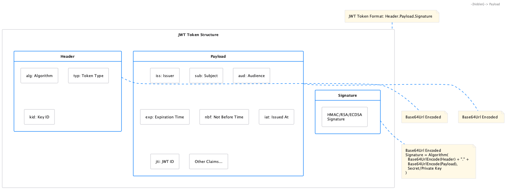

= JWT Token Handling Requirements
:toc: left
:toclevels: 3
:toc-title: Table of Contents
:sectnums:
:source-highlighter: highlight.js

== Overview

This document outlines the functional and non-functional requirements for the JWT Token Validation library.

=== Document Navigation

* xref:../README.adoc[README] - Project overview and introduction
* xref:../oauth-sheriff-core/README.adoc[Usage Guide] - How to use the library with code examples
* xref:Specification.adoc[Specification] - Technical specifications
* xref:LogMessages.adoc[Log Messages] - Reference for all log messages
* xref:security/Threat-Model.adoc[Threat Model] - Security analysis and mitigations
* xref:Build.adoc[Building and Development] - Information for contributors

== Referenced Standards

The following standards and specifications are referenced in this document:

* https://datatracker.ietf.org/doc/html/rfc7519[RFC 7519 - JSON Web Token (JWT)] - May 2015
* https://datatracker.ietf.org/doc/html/rfc7518[RFC 7518 - JSON Web Algorithms (JWA)] - May 2015
* https://datatracker.ietf.org/doc/html/rfc7517[RFC 7517 - JSON Web Key (JWK)] - May 2015
* https://datatracker.ietf.org/doc/html/rfc7516[RFC 7516 - JSON Web Encryption (JWE)] - May 2015
* https://datatracker.ietf.org/doc/html/rfc6749[RFC 6749 - OAuth 2.0 Authorization Framework] - October 2012
* https://openid.net/specs/openid-connect-core-1_0.html[OpenID Connect Core 1.0] - November 2014
* https://datatracker.ietf.org/doc/html/draft-ietf-oauth-jwt-bcp-09[OAuth 2.0 JWT Best Current Practices] - Latest draft, July 2023
* https://nvlpubs.nist.gov/nistpubs/SpecialPublications/NIST.SP.800-131Ar2.pdf[NIST SP 800-131A Revision 2] - March 2019
* https://www.rfc-editor.org/rfc/rfc8017.html[RFC 8017 - PKCS #1: RSA Cryptography Specifications Version 2.2] - November 2016

== Functional Requirements

[#OAUTH-SHERIFF-1]
=== OAUTH-SHERIFF-1: Token Parsing and Validation

The library must provide robust token parsing and validation capabilities in accordance with https://datatracker.ietf.org/doc/html/rfc7519[RFC 7519 - JSON Web Token (JWT)] (May 2015).

_See specifications: xref:specification/technical-components.adoc[Technical Components] and xref:security/security-specifications.adoc[Security Specifications]_

[#OAUTH-SHERIFF-1.1]
==== OAUTH-SHERIFF-1.1: Token Structure

The library must support standard JWT token structure with header, payload, and signature as defined in RFC 7519 (May 2015).

_See specification: xref:specification/technical-components.adoc#token-architecture-and-types[Token Architecture and Types]_

[#OAUTH-SHERIFF-1.2]
==== OAUTH-SHERIFF-1.2: Token Types

The library must support different token types as defined in https://datatracker.ietf.org/doc/html/rfc6749[RFC 6749 - OAuth 2.0] (October 2012) and https://openid.net/specs/openid-connect-core-1_0.html[OpenID Connect Core 1.0] (November 2014):

* Access tokens
* ID tokens
* Refresh tokens

_See specification: xref:specification/technical-components.adoc#token-architecture-and-types[Token Architecture and Types]_

[#OAUTH-SHERIFF-1.3]
==== OAUTH-SHERIFF-1.3: Signature Validation

The library must validate token signatures using cryptographic algorithms as specified in https://datatracker.ietf.org/doc/html/rfc7518[RFC 7518 - JSON Web Algorithms (JWA)].

For security reasons, only the following signature algorithms shall be supported (in accordance with https://datatracker.ietf.org/doc/html/draft-ietf-oauth-jwt-bcp-09[OAuth 2.0 JWT Best Current Practices] (July 2023) and https://nvlpubs.nist.gov/nistpubs/SpecialPublications/NIST.SP.800-131Ar2.pdf[NIST SP 800-131A] (March 2019)):

* RS256 (RSA Signature with SHA-256)
* RS384 (RSA Signature with SHA-384)
* RS512 (RSA Signature with SHA-512)
* ES256 (ECDSA using P-256 and SHA-256)
* ES384 (ECDSA using P-384 and SHA-384)
* ES512 (ECDSA using P-521 and SHA-512)

The following algorithms shall NOT be supported due to security concerns:

* HS256, HS384, HS512 (HMAC with SHA-2) - Vulnerable to https://auth0.com/blog/critical-vulnerabilities-in-json-web-token-libraries/[key confusion attacks] (2015) when used in combination with RSA public keys
* "none" algorithm - Explicitly forbidden by https://datatracker.ietf.org/doc/html/draft-ietf-oauth-jwt-bcp-09#section-3.1[OAuth 2.0 JWT BCP Section 3.1] and https://cwe.mitre.org/data/definitions/347.html[CWE-347: Improper Verification of Cryptographic Signature]
* RSA based algorithms (like RS256, RS384, RS512) with keys shorter than 2048 bits - Not compliant with https://nvlpubs.nist.gov/nistpubs/SpecialPublications/NIST.SP.800-131Ar2.pdf[NIST SP 800-131A] (2019)
* All RSASSA-PKCS1-v1_5 algorithms - Considered legacy by https://www.rfc-editor.org/rfc/rfc8017.html#section-8.2[RFC 8017] (2016) in favor of RSASSA-PSS

Additional security considerations:

* The library must implement https://datatracker.ietf.org/doc/html/draft-ietf-oauth-jwt-bcp-09#section-3.10[algorithm verification] to prevent algorithm substitution attacks (CVE-2015-9235)
* The library must validate that the algorithm specified in the JWT header matches the expected algorithm for the key
* The library must reject tokens with invalid signatures rather than falling back to less secure validation methods

_See specifications: xref:specification/technical-components.adoc#token-validation-pipeline[Token Validation Pipeline] and xref:security/security-specifications.adoc#signature-validation[Signature Validation]_

[#OAUTH-SHERIFF-1.4]
==== OAUTH-SHERIFF-1.4: Token Decryption (Optional - Future Version)

The library should support decryption of encrypted JWT tokens (JWE) as defined in https://datatracker.ietf.org/doc/html/rfc7516[RFC 7516 - JSON Web Encryption (JWE)] (May 2015) in a future version.

_See specification: xref:specification/token-decryption.adoc[Token Decryption]_

[#OAUTH-SHERIFF-2]
=== OAUTH-SHERIFF-2: Token Representation

The library must provide type-safe token representations.

_See specification: xref:specification/technical-components.adoc#token-architecture-and-types[Token Architecture and Types]_

[#OAUTH-SHERIFF-2.1]
==== OAUTH-SHERIFF-2.1: Base Token Functionality

A base token representation must provide common token functionality:

* Access to token claims as defined in RFC 7519
* Expiration checking (exp claim)
* Issuer information (iss claim)
* Subject information (sub claim)
* Issued at time (iat claim)
* Not before time (nbf claim)
* JWT ID (jti claim)

_See specification: xref:specification/technical-components.adoc#token-architecture-and-types[Token Architecture and Types]_

[#OAUTH-SHERIFF-2.2]
==== OAUTH-SHERIFF-2.2: Access Token Functionality

The access token representation must provide:

* Scope-based authorization (scope claim) as defined in RFC 6749
* Role-based authorization (roles or groups claims)
* Resource access information

_See specification: xref:specification/technical-components.adoc#token-architecture-and-types[Token Architecture and Types]_

[#OAUTH-SHERIFF-2.3]
==== OAUTH-SHERIFF-2.3: ID Token Functionality

The ID token representation must provide user identity information as defined in OpenID Connect Core 1.0, including:

* User identity information (sub, name, preferred_username, email, etc.)
* Authentication context information (auth_time, acr, amr, etc.)

_See specification: xref:specification/technical-components.adoc#token-architecture-and-types[Token Architecture and Types]_

[#OAUTH-SHERIFF-2.4]
==== OAUTH-SHERIFF-2.4: Refresh Token Functionality

The refresh token representation must provide:

* Token refresh capabilities as defined in RFC 6749
* Token lifecycle management

_See specification: xref:specification/technical-components.adoc#token-architecture-and-types[Token Architecture and Types]_

[#OAUTH-SHERIFF-3]
=== OAUTH-SHERIFF-3: Multi-Issuer Support

The library must support tokens from multiple issuers.

_See specification: xref:specification/technical-components.adoc#issuerconfig-and-multi-issuer-support[Multi-Issuer Support]_

[#OAUTH-SHERIFF-3.1]
==== OAUTH-SHERIFF-3.1: Issuer Configuration

Support configuration of multiple token issuers with different validation parameters.

_See specification: xref:specification/technical-components.adoc#issuerconfig-and-multi-issuer-support[Multi-Issuer Support]_

[#OAUTH-SHERIFF-3.2]
==== OAUTH-SHERIFF-3.2: Issuer Selection

Automatically select the appropriate issuer configuration based on the token.

_See specification: xref:specification/technical-components.adoc#issuerconfig-and-multi-issuer-support[Multi-Issuer Support]_

[#OAUTH-SHERIFF-3.3]
==== OAUTH-SHERIFF-3.3: Issuer Validation

Validate that tokens come from trusted issuers.

_See specification: xref:specification/technical-components.adoc#issuerconfig-and-multi-issuer-support[Multi-Issuer Support]_

[#OAUTH-SHERIFF-4]
=== OAUTH-SHERIFF-4: Key Management

The library must support public key management for token validation in accordance with https://datatracker.ietf.org/doc/html/rfc7517[RFC 7517 - JSON Web Key (JWK)] (May 2015).

_See specifications: xref:specification/technical-components.adoc#jwksloader[Key Management], xref:specification/well-known.adoc[OIDC Discovery], and xref:security/security-specifications.adoc#key-management[Security Key Management]_

[#OAUTH-SHERIFF-4.1]
==== OAUTH-SHERIFF-4.1: JWKS Endpoint Support

Support fetching public keys from JWKS endpoints as defined in https://datatracker.ietf.org/doc/html/rfc7517#section-5[RFC 7517 Section 5 - JWK Set Format] (May 2015).

_See specifications: xref:specification/technical-components.adoc#jwksloader[JwksLoader] and xref:specification/well-known.adoc[OIDC Discovery]_

[#OAUTH-SHERIFF-4.2]
==== OAUTH-SHERIFF-4.2: Key Caching

Cache keys to improve performance with configurable cache expiration.

_See specification: xref:specification/technical-components.adoc#jwksloader[JwksLoader]_

[#OAUTH-SHERIFF-4.3]
==== OAUTH-SHERIFF-4.3: Key Rotation

Support automatic key rotation based on configurable refresh intervals.

_See specification: xref:specification/technical-components.adoc#jwksloader[JwksLoader]_

[#OAUTH-SHERIFF-4.4]
==== OAUTH-SHERIFF-4.4: Local Key Support

Support local key configuration for testing or offline scenarios.

_See specification: xref:specification/technical-components.adoc#jwksloader[JwksLoader]_

[#OAUTH-SHERIFF-4.5]
==== OAUTH-SHERIFF-4.5: Key Rotation Grace Period

The library must support a configurable grace period for retired keys during key rotation to ensure uninterrupted service during the transition period, as recommended by https://datatracker.ietf.org/doc/html/draft-ietf-oauth-jwt-bcp-09#section-3.9[OAuth 2.0 JWT Best Current Practices Section 3.9] (July 2023).

Key requirements:

* Retain retired keys for a configurable grace period (default: 5 minutes)
* Support immediate key invalidation with zero grace period configuration
* Automatically clean up expired keys beyond the grace period
* Limit the number of retained retired key sets to prevent unbounded memory growth
* Prevent unnecessary key rotation when JWKS content has not changed

This ensures that tokens signed with recently rotated keys remain valid during the transition period, preventing service disruptions for in-flight requests.

_See specification: xref:specification/technical-components.adoc#jwksloader[JwksLoader]_

[#OAUTH-SHERIFF-5]
=== OAUTH-SHERIFF-5: Token Parsing

Provide a mechanism for parsing token strings into structured representations.

_See specification: xref:specification/technical-components.adoc#tokenvalidator[TokenValidator]_

[#OAUTH-SHERIFF-5.1]
==== OAUTH-SHERIFF-5.1: Token Parsing Methods

The library must provide methods for parsing different token types:

* Access tokens
* ID tokens
* Refresh tokens

_See specification: xref:specification/technical-components.adoc#tokenvalidator[TokenValidator]_

[#OAUTH-SHERIFF-6]
=== OAUTH-SHERIFF-6: Configuration

Provide a flexible configuration mechanism for token validation.

_See specification: xref:specification/technical-components.adoc#issuerconfig-and-multi-issuer-support[Configuration]_

[#OAUTH-SHERIFF-6.1]
==== OAUTH-SHERIFF-6.1: Configuration Flexibility

The configuration mechanism must support different validation settings for different token types and issuers.

_See specification: xref:specification/technical-components.adoc#issuerconfig-and-multi-issuer-support[Configuration]_

[#OAUTH-SHERIFF-7]
=== OAUTH-SHERIFF-7: Logging

Implement comprehensive logging for troubleshooting and auditing, following the https://owasp.org/www-project-proactive-controls/v3/en/c9-implement-security-logging-monitoring[OWASP Proactive Controls C9: Implement Security Logging and Monitoring] guidelines.

_See specifications: xref:specification/technical-components.adoc#securityeventcounter[SecurityEventCounter] and xref:security/security-specifications.adoc#security-events-monitoring[Security Events]_

[#OAUTH-SHERIFF-7.1]
==== OAUTH-SHERIFF-7.1: Log Levels

Support different log levels for different types of events:

* ERROR: Authentication failures, token validation errors
* WARN: Suspicious activities, token format issues
* INFO: Successful token validations, key rotations
* DEBUG: Detailed token processing information
* TRACE: Highly detailed debugging information

_See specification: xref:specification/testing.adoc#logging-tests[Logging Tests]_

[#OAUTH-SHERIFF-7.2]
==== OAUTH-SHERIFF-7.2: Log Content

Log messages must include relevant information for troubleshooting without exposing sensitive data, as recommended by https://cheatsheetseries.owasp.org/cheatsheets/Logging_Cheat_Sheet.html[OWASP Logging Cheat Sheet].

* Include: timestamps, event types, source components, outcome (success/failure)
* Exclude: full tokens, private keys, passwords

_See specification: xref:specification/testing.adoc#logging-tests[Logging Tests]_

[#OAUTH-SHERIFF-7.3]
==== OAUTH-SHERIFF-7.3: Security Events

Log security-relevant events as recommended by https://datatracker.ietf.org/doc/html/rfc8417[RFC 8417 - Security Event Token (SET)] (July 2018):

* Token validation failures
* Key rotation events
* Configuration changes
* Suspicious token usage patterns

_See specifications: xref:specification/technical-components.adoc#securityeventcounter[SecurityEventCounter] and xref:security/security-specifications.adoc#security-events-monitoring[Security Events]_

[#OAUTH-SHERIFF-8]
=== OAUTH-SHERIFF-8: Security

The library must implement security best practices as defined in the https://cheatsheetseries.owasp.org/cheatsheets/JSON_Web_Token_for_Java_Cheat_Sheet.html[OWASP JWT Security Cheat Sheet for Java].

_See specifications: xref:security/security-specifications.adoc[Security Specifications], xref:security/Threat-Model.adoc[Threat Model], xref:security/jwt-attacks-analysis.adoc[JWT Attacks Analysis], xref:security/oauth-security-analysis.adoc[OAuth Security], and xref:security/jwt-security-best-practices.adoc[Security Best Practices]_

[#OAUTH-SHERIFF-8.1]
==== OAUTH-SHERIFF-8.1: Token Size Limits

Implement token size limits to prevent denial of service attacks. Maximum token size should be 8KB as recommended by https://datatracker.ietf.org/doc/html/draft-ietf-oauth-jwt-bcp-09#section-3.11[OAuth 2.0 JWT BCP Section 3.11].

_See specifications: xref:specification/token-size-validation.adoc[Token Size Validation] and xref:specification/jwks-size-recommendations.adoc[JWKS Size Recommendations]_

[#OAUTH-SHERIFF-8.2]
==== OAUTH-SHERIFF-8.2: Safe Parsing

Implement safe parsing practices to prevent security vulnerabilities such as:

* JSON parsing attacks
* Injection attacks
* Deserialization vulnerabilities
For example, vulnerabilities could include issues like entity expansion in XML parsers (if applicable to the JSON parser's underlying mechanisms or if XML is also processed), or object injection if deserializing into complex type hierarchies without proper validation.

Refer to https://owasp.org/www-project-top-ten/[OWASP Top 10] (2021) for common vulnerabilities, particularly A8:2021-Software and Data Integrity Failures.

_See specification: xref:security/security-specifications.adoc#safe-parsing[Safe Parsing]_

[#OAUTH-SHERIFF-8.3]
==== OAUTH-SHERIFF-8.3: Secure Communication

Support secure communication for key retrieval using TLS 1.2 or higher as recommended by https://nvlpubs.nist.gov/nistpubs/SpecialPublications/NIST.SP.800-52r2.pdf[NIST SP 800-52 Rev. 2] (2019).

_See specification: xref:security/security-specifications.adoc#secure-communication[Secure Communication]_

[#OAUTH-SHERIFF-8.4]
==== OAUTH-SHERIFF-8.4: Claims Validation

Validate token claims according to RFC 7519 (May 2015) and OpenID Connect Core 1.0 (November 2014), including:

* Expiration time (exp)
* Not before time (nbf)
* Issuer (iss)
* Audience (aud)

_See specification: xref:security/security-specifications.adoc#claims-validation[Claims Validation]_

[#OAUTH-SHERIFF-8.5]
==== OAUTH-SHERIFF-8.5: Cryptographic Agility

The library must support cryptographic agility as recommended by https://datatracker.ietf.org/doc/html/draft-ietf-oauth-jwt-bcp-09#section-3.8[OAuth 2.0 JWT BCP Section 3.8], allowing for algorithm upgrades without breaking changes.

_See specification: xref:security/security-specifications.adoc#cryptographic-agility[Cryptographic Agility]_

[#OAUTH-SHERIFF-12]
=== OAUTH-SHERIFF-12: Testing and Quality Assurance

_See specification: xref:specification/testing.adoc[Testing Specification]_

[#OAUTH-SHERIFF-12.1]
==== OAUTH-SHERIFF-12.1: Security Testing

The library must undergo comprehensive security testing according to https://cheatsheetseries.owasp.org/cheatsheets/JSON_Web_Token_for_Java_Cheat_Sheet.html[OWASP JWT Security Cheat Sheet for Java] (2023) and https://github.com/OWASP/CheatSheetSeries/blob/master/cheatsheets/JSON_Web_Token_Cheat_Sheet.md[OWASP JWT Cheat Sheet] (2023).

Key security tests must include:

* Token validation bypass tests
* Algorithm confusion attack tests
* Key disclosure vulnerability tests
* Signature verification bypass tests
* Token cracking resistance tests

_See specifications: xref:specification/testing.adoc#security-testing[Security Testing] and xref:security/security-specifications.adoc#security-testing-specifications[Security Testing Specifications]_

[#OAUTH-SHERIFF-12.2]
==== OAUTH-SHERIFF-12.2: Unit Testing

The library must have comprehensive unit tests with at least 80% code coverage, including:

* Token parsing tests
* Token validation tests
* Error handling tests
* Edge case tests (malformed tokens, expired tokens, etc.)

_See specification: xref:specification/testing.adoc#unit-testing[Unit Testing]_

[#OAUTH-SHERIFF-12.3]
==== OAUTH-SHERIFF-12.3: Integration Testing

Integration tests must verify compatibility with Keycloak as the identity provider:

* Parse access tokens from Keycloak
* Parse ID tokens from Keycloak
* Parse refresh tokens from Keycloak
* Validate tokens against Keycloak JWKS endpoint
* Handle token expiration and validation

_See specification: xref:specification/testing.adoc#integration-testing-with-testcontainers[Integration Testing]_

[#OAUTH-SHERIFF-12.4]
==== OAUTH-SHERIFF-12.4: Vulnerability Scanning

The library must be regularly scanned for vulnerabilities using:

* Automated dependency vulnerability scanning for third-party dependencies
* Static Application Security Testing (SAST) tools
* Fuzz-Testing tools for input validation vulnerabilities

_See specification: xref:specification/testing.adoc#vulnerability-scanning[Vulnerability Scanning]_

[#OAUTH-SHERIFF-12.5]
==== OAUTH-SHERIFF-12.5: Compliance Testing

Tests must verify compliance with:

* https://openid.net/certification/[OpenID Connect Certification] requirements
* https://www.rfc-editor.org/rfc/rfc7519[RFC 7519] JWT specification
* https://datatracker.ietf.org/doc/html/draft-ietf-oauth-jwt-bcp-09[OAuth 2.0 JWT Best Current Practices]

_See specification: xref:specification/testing.adoc#compliance-testing[Compliance Testing]_

== Non-Functional Requirements

[#OAUTH-SHERIFF-9]
=== OAUTH-SHERIFF-9: Performance

Performance requirements are verified through comprehensive benchmarking:

* **Micro-benchmarks** (JMH): Library-level performance testing
* **Integration benchmarks** (WRK): End-to-end HTTP performance testing

_See analysis: xref:../benchmarking/doc/Analysis-10.2025-Micro.adoc[Micro-Benchmark Analysis] and xref:../benchmarking/doc/Analysis-10.2025-Integration.adoc[Integration Benchmark Analysis]_

[#OAUTH-SHERIFF-9.1]
==== OAUTH-SHERIFF-9.1: Library Performance (Micro-Benchmarks)

**Requirements:**

* JWT validation throughput: > 100,000 ops/s (100 concurrent threads)
* Average validation latency: < 0.7ms
* P99 validation latency: < 0.2ms
* Cache lookup latency: < 0.2µs

**Measured Performance (JMH on Apple M4, 100 threads):**

* **Core validation**: 108,400 ops/s ✅
* **Average latency**: 0.644ms ✅
* **P50 latency**: 53µs (P95: 79µs, P99: 116µs) ✅
* **Signature validation**: P50=45µs (85% of total time)
* **Cache operations**: P50=0.1µs ✅
* **Token parsing**: P50=3.1µs

_See detailed analysis: xref:../benchmarking/doc/Analysis-10.2025-Micro.adoc[Micro-Benchmark Analysis (October 2025)]_

[#OAUTH-SHERIFF-9.2]
==== OAUTH-SHERIFF-9.2: Error Handling Performance

**Requirements:**

* Invalid token validation: < 2ms average time
* Error throughput improvement: Fast-fail on invalid tokens should improve throughput

**Measured Performance (JMH on Apple M4, 100 threads):**

* **All valid tokens**: 145,200 ops/s ✅
* **50% invalid tokens**: 225,200 ops/s (+108% throughput improvement) ✅
* **Fast-fail optimization**: Invalid tokens rejected early without full processing

_See detailed analysis: xref:../benchmarking/doc/Analysis-10.2025-Micro.adoc#error-handling-performance[Error Handling Performance]_

[#OAUTH-SHERIFF-9.3]
==== OAUTH-SHERIFF-9.3: Integration Performance (HTTP/REST)

**Requirements:**

* HTTP JWT validation: > 20,000 ops/s (150 connections, stress profile)
* P50 latency: < 10ms
* P99 latency: < 50ms
* Health check baseline: > 60,000 ops/s
* Zero timeout errors

**Measured Performance (WRK on Apple M4, Docker, 150 connections):**

* **JWT validation (no cache)**: 20,400 ops/s ✅
* **JWT validation (cache enabled)**: 21,900 ops/s ✅
* **P50 latency**: 6.30ms (P90: 17.55ms, P99: 39.38ms) ✅
* **Health check**: 77,600 ops/s ✅
* **Error rate**: 0% timeouts ✅
* **CPU usage**: 89.9% peak, 74.3% average (JWT with cache)

_See detailed analysis: xref:../benchmarking/doc/Analysis-10.2025-Integration.adoc[Integration Benchmark Analysis (October 2025)]_

[#OAUTH-SHERIFF-9.4]
==== OAUTH-SHERIFF-9.4: Cache Performance

**Requirements:**

* Cached key lookup: < 0.5µs P50
* Cache hit rate: > 95% (appropriate cache size)
* Cache effectiveness: Measurable throughput improvement with caching enabled

**Measured Performance:**

* **Cache lookup**: P50=0.1µs (P95: 0.3µs) ✅
* **Cache store**: P50=0.1µs (P95: 0.8µs) ✅
* **Cache hit rate**: 100% (cache size 20, integration tests) ✅
* **Cache effectiveness**: +7.4% throughput improvement (21,900 vs 20,400 ops/s) ✅
* **Cached validation time**: 0.33ms average per token

_See analysis: xref:../benchmarking/doc/Analysis-10.2025-Integration.adoc[Integration Performance Analysis]_

[#OAUTH-SHERIFF-9.5]
==== OAUTH-SHERIFF-9.5: Scalability and Concurrency

**Requirements:**

* Stable performance across 50-300 concurrent connections
* Consistent JWT throughput: 20,000-22,000 ops/s regardless of connection count
* Thread scaling: Efficient scaling up to 100+ threads

**Measured Performance:**

* **JWT stability**: 20.1-21.6K ops/s across 50-300 connections ✅
* **Optimal configuration**: 100 connections (77.1K health, 21.6K JWT) ✅
* **Thread scaling**: 100 concurrent threads with 108K ops/s (library) ✅
* **Latency scaling**: P50 increases linearly with connections (6.3ms @ 150 conns)

_See analysis: xref:../benchmarking/doc/Analysis-10.2025-Integration.adoc#connection-count-investigation-results[Connection Scaling Analysis]_

[#OAUTH-SHERIFF-10]
=== OAUTH-SHERIFF-10: Reliability

_See specification: xref:specification/technical-components.adoc#exception-based-validation[Exception-based Validation]_

[#OAUTH-SHERIFF-10.1]
==== OAUTH-SHERIFF-10.1: Thread Safety

The implementation must be thread-safe.

_See specification: xref:specification/technical-components.adoc#issuerconfig-and-multi-issuer-support[Multi-Issuer Support]_

[#OAUTH-SHERIFF-10.2]
==== OAUTH-SHERIFF-10.2: Error Handling

The implementation must handle errors gracefully and provide meaningful error messages.

_See specification: xref:specification/technical-components.adoc#exception-based-validation[Exception-based Validation]_
